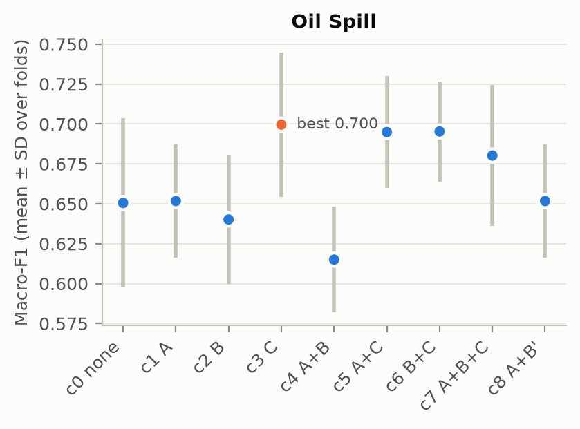
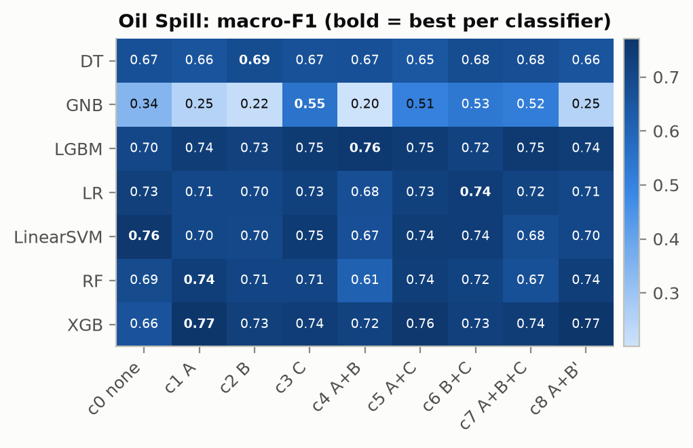
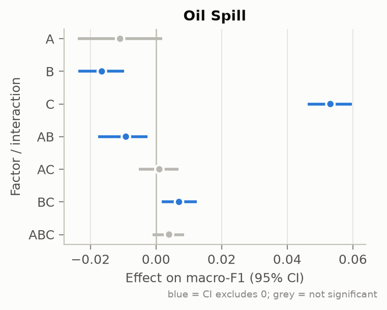
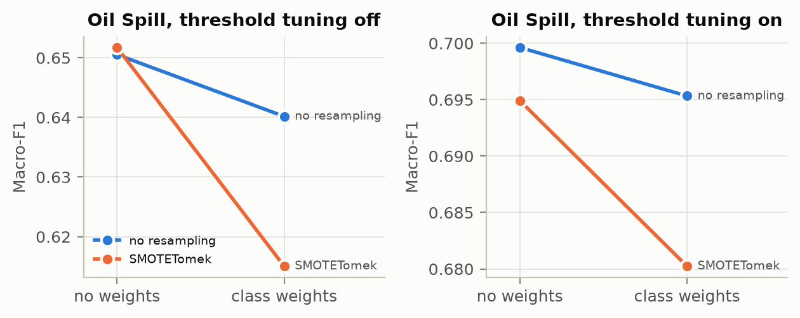
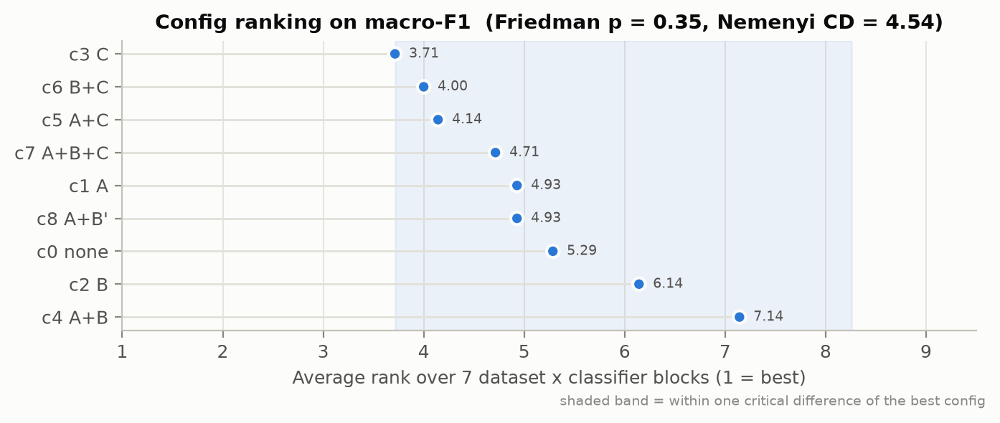
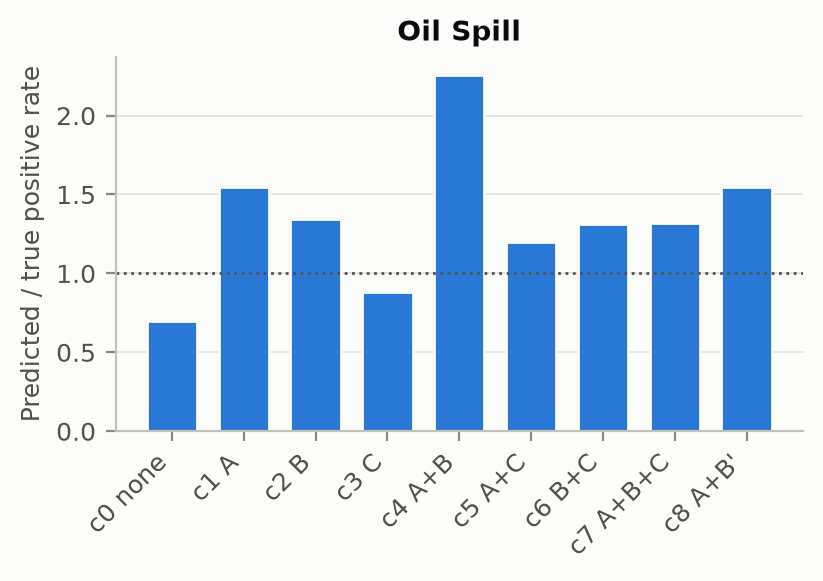
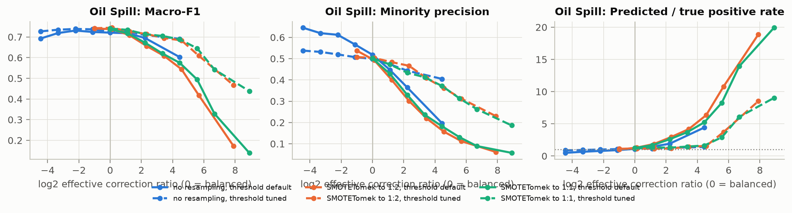

# Results: factorial ablation of imbalance corrections

Datasets compiled: Oil Spill. 2,190 result rows. Generated by `analysis/compile.py`; every number below is recomputed from the CSVs in `*/*/results/`.
Not yet included (main configs incomplete): smsspam.

## 0. Completeness

| dataset | experiment | config_id | rows | expected | complete | git_commits | metric_nans |
|---|---|---|---|---|---|---|---|
| oilspill | e2 | e2 | 1560 | 1560 | True | a84542c,c5272b8 | 0 |
| oilspill | main | c0_none | 70 | 70 | True | c5272b8 | 0 |
| oilspill | main | c1_A_smotetomek | 70 | 70 | True | c5272b8 | 0 |
| oilspill | main | c2_B_weights | 70 | 70 | True | c5272b8 | 0 |
| oilspill | main | c3_C_threshold | 70 | 70 | True | c5272b8 | 0 |
| oilspill | main | c4_AB_smotetomek_weights | 70 | 70 | True | c5272b8 | 0 |
| oilspill | main | c5_AC_smotetomek_threshold | 70 | 70 | True | c5272b8 | 0 |
| oilspill | main | c6_BC_weights_threshold | 70 | 70 | True | c5272b8 | 0 |
| oilspill | main | c7_ABC_full | 70 | 70 | True | c5272b8 | 0 |
| oilspill | main | c8_A_Brecalc | 70 | 70 | True | c5272b8 | 0 |
| smsspam | main | c0_none | 45 | 70 | False | a84542c,c5272b8 | 0 |

## 1. Macro-F1 by configuration
Mean ± SD over the 10 outer folds, after averaging the 7 classifiers within each fold.

| config_id | oilspill |
|---|---|
| c0_none | 0.6505 ± 0.0531 |
| c1_A_smotetomek | 0.6517 ± 0.0356 |
| c2_B_weights | 0.6402 ± 0.0404 |
| c3_C_threshold | 0.6996 ± 0.0452 |
| c4_AB_smotetomek_weights | 0.6150 ± 0.0332 |
| c5_AC_smotetomek_threshold | 0.6949 ± 0.0351 |
| c6_BC_weights_threshold | 0.6953 ± 0.0315 |
| c7_ABC_full | 0.6802 ± 0.0441 |
| c8_A_Brecalc | 0.6517 ± 0.0356 |

Per classifier (mean over folds):

**Oil Spill**

| classifier | c0 none | c1 A | c2 B | c3 C | c4 A+B | c5 A+C | c6 B+C | c7 A+B+C | c8 A+B' |
|---|---|---|---|---|---|---|---|---|---|
| DT | 0.6699 | 0.6553 | 0.6860 | 0.6681 | 0.6685 | 0.6480 | 0.6846 | 0.6751 | 0.6553 |
| GNB | 0.3439 | 0.2477 | 0.2184 | 0.5496 | 0.2007 | 0.5053 | 0.5335 | 0.5184 | 0.2477 |
| LGBM | 0.7026 | 0.7426 | 0.7254 | 0.7501 | 0.7552 | 0.7459 | 0.7209 | 0.7546 | 0.7426 |
| LR | 0.7307 | 0.7061 | 0.7047 | 0.7272 | 0.6754 | 0.7274 | 0.7416 | 0.7164 | 0.7061 |
| LinearSVM | 0.7597 | 0.7032 | 0.7014 | 0.7483 | 0.6706 | 0.7424 | 0.7403 | 0.6842 | 0.7032 |
| RF | 0.6890 | 0.7366 | 0.7127 | 0.7144 | 0.6123 | 0.7356 | 0.7179 | 0.6701 | 0.7366 |
| XGB | 0.6580 | 0.7707 | 0.7327 | 0.7397 | 0.7226 | 0.7598 | 0.7285 | 0.7429 | 0.7707 |

## 2. Other metrics (mean over classifiers and folds)

| dataset | config_id | mcc | pr_auc | roc_auc | balanced_acc | gmean | precision_1 | recall_1 |
|---|---|---|---|---|---|---|---|---|
| oilspill | c0_none | 0.3841 | 0.4297 | 0.8554 | 0.6550 | 0.5616 | 0.5435 | 0.4002 |
| oilspill | c1_A_smotetomek | 0.3923 | 0.4373 | 0.8550 | 0.7190 | 0.6757 | 0.3971 | 0.5751 |
| oilspill | c2_B_weights | 0.3854 | 0.4267 | 0.8578 | 0.7195 | 0.6631 | 0.3908 | 0.5825 |
| oilspill | c3_C_threshold | 0.4189 | 0.4297 | 0.8554 | 0.6989 | 0.6054 | 0.5020 | 0.4204 |
| oilspill | c4_AB_smotetomek_weights | 0.3452 | 0.4052 | 0.8311 | 0.7311 | 0.6949 | 0.2934 | 0.6347 |
| oilspill | c5_AC_smotetomek_threshold | 0.4099 | 0.4373 | 0.8550 | 0.7148 | 0.6222 | 0.4434 | 0.4609 |
| oilspill | c6_BC_weights_threshold | 0.4153 | 0.4267 | 0.8578 | 0.7256 | 0.6505 | 0.4404 | 0.4885 |
| oilspill | c7_ABC_full | 0.3816 | 0.4052 | 0.8311 | 0.7129 | 0.6175 | 0.4000 | 0.4598 |
| oilspill | c8_A_Brecalc | 0.3923 | 0.4373 | 0.8550 | 0.7190 | 0.6757 | 0.3971 | 0.5751 |

## 3. Factorial effects (reviewer R2)
Yates effects of the 2x2x2 design on macro-F1: mean with the factor on minus mean with it off (interactions: difference of differences). 95% CI from 2,000 paired bootstrap resamples of the outer folds, averaged over the 7 classifiers. A = SMOTETomek, B = class weights (original ratio), C = threshold tuning.

| dataset | term | effect | CI | significant |
|---|---|---|---|---|
| oilspill | A | -0.0109 | [-0.0238, 0.0019] | False |
| oilspill | B | -0.0165 | [-0.0237, -0.0097] | True |
| oilspill | C | 0.0532 | [0.0463, 0.0597] | True |
| oilspill | AB | -0.0092 | [-0.0177, -0.0025] | True |
| oilspill | AC | 0.0010 | [-0.0053, 0.0069] | False |
| oilspill | BC | 0.0070 | [0.0017, 0.0125] | True |
| oilspill | ABC | 0.0040 | [-0.0011, 0.0086] | False |

Pooled over datasets (OLS on fold-level scores, dataset and classifier fixed effects, standard errors clustered by outer fold; effect = 2 x coefficient):

| term | effect | ci_low | ci_high | p_value |
|---|---|---|---|---|
| A | -0.0109 | -0.0247 | 0.0028 | 0.1196 |
| B | -0.0165 | -0.0241 | -0.0089 | 0.0000 |
| C | 0.0532 | 0.0460 | 0.0603 | 0.0000 |
| AB | -0.0092 | -0.0171 | -0.0013 | 0.0227 |
| AC | 0.0010 | -0.0057 | 0.0077 | 0.7623 |
| BC | 0.0070 | 0.0014 | 0.0126 | 0.0143 |
| ABC | 0.0040 | -0.0012 | 0.0092 | 0.1343 |

## 4. Key comparisons (reviewers R6, R7)
Blocks = dataset x classifier. `median_diff` = second config minus first on macro-F1. Wilcoxon signed-rank over blocks with Holm correction; rank-biserial r in [-1, 1]; `blocks_sig_5x2cv` = blocks where Alpaydin's 5x2cv F-test gives p < 0.05, `of_which_better` = how many of those favour the second config.

Note on c8: SMOTETomek balances the training data to exactly 1:1, and its Tomek-link step removes linked pairs from both classes, so the balance stays exact. Weights recomputed after resampling are therefore exactly 1 and c8 is identical to c1 (resampling alone). Recomputing only changes anything when resampling does not fully balance the data; E2 covers that case (SMOTETomek to 1:2 with `recalc`).

| comparison | question | blocks | median_diff | CI | wins | losses | p_holm | rank_biserial | blocks_sig_5x2cv | of_which_better |
|---|---|---|---|---|---|---|---|---|---|---|
| c1_A_smotetomek vs c0_none | Resampling alone vs no correction | 7 | -0.0146 | [-0.0566, 0.0476] | 3 | 4 | 1.0000 | 0.0000 | 0 | 0 |
| c2_B_weights vs c0_none | Class weights alone vs no correction | 7 | 0.0161 | [-0.0583, 0.0236] | 4 | 3 | 1.0000 | -0.1429 | 0 | 0 |
| c3_C_threshold vs c0_none | Threshold tuning alone vs no correction | 7 | 0.0254 | [-0.0035, 0.0817] | 4 | 3 | 0.6562 | 0.5714 | 0 | 0 |
| c4_AB_smotetomek_weights vs c2_B_weights | Adding resampling on top of weights | 7 | -0.0176 | [-0.0308, -0.0101] | 1 | 6 | 0.6250 | -0.6429 | 1 | 0 |
| c4_AB_smotetomek_weights vs c1_A_smotetomek | Adding original-ratio weights on top of resampling | 7 | -0.0326 | [-0.0481, 0.0126] | 2 | 5 | 0.4688 | -0.7857 | 1 | 0 |
| c8_A_Brecalc vs c4_AB_smotetomek_weights | Original vs recomputed weights after resampling (R7) | 7 | 0.0326 | [-0.0126, 0.0481] | 5 | 2 | 0.4688 | 0.7857 | 1 | 1 |
| c7_ABC_full vs c4_AB_smotetomek_weights | Does threshold tuning repair stacked corrections? | 7 | 0.0204 | [0.0066, 0.0578] | 6 | 1 | 0.2188 | 0.9286 | 1 | 1 |

## 5. Ranking of the 9 configurations
Friedman test over 7 blocks: p = 0.351. Nemenyi critical difference = 4.54 ranks: configs closer than this to each other are not significantly different.

| config_id | average rank (1 = best) |
|---|---|
| c3_C_threshold | 3.71 |
| c6_BC_weights_threshold | 4.00 |
| c5_AC_smotetomek_threshold | 4.14 |
| c7_ABC_full | 4.71 |
| c1_A_smotetomek | 4.93 |
| c8_A_Brecalc | 4.93 |
| c0_none | 5.29 |
| c2_B_weights | 6.14 |
| c4_AB_smotetomek_weights | 7.14 |

## 6. Over-correction mechanism
`rho_eff` = positive:negative loss mass the classifier sees (1 = balanced). `ppr_ratio` = predicted positive rate / true positive rate (1 = as many positives predicted as exist; above 1 = over-predicting the minority). Values are the median over the 7 classifiers of each classifier's mean over folds.

| dataset | config_id | rho_eff | ppr_ratio | precision_1 | recall_1 | macro_f1 |
|---|---|---|---|---|---|---|
| oilspill | c0_none | 0.046 | 0.701 | 0.602 | 0.331 | 0.689 |
| oilspill | c1_A_smotetomek | 1.000 | 1.546 | 0.347 | 0.575 | 0.706 |
| oilspill | c2_B_weights | 1.000 | 1.345 | 0.373 | 0.493 | 0.705 |
| oilspill | c3_C_threshold | 0.046 | 0.885 | 0.529 | 0.479 | 0.727 |
| oilspill | c4_AB_smotetomek_weights | 21.867 | 2.257 | 0.295 | 0.626 | 0.671 |
| oilspill | c5_AC_smotetomek_threshold | 1.000 | 1.196 | 0.468 | 0.541 | 0.736 |
| oilspill | c6_BC_weights_threshold | 1.000 | 1.315 | 0.468 | 0.472 | 0.721 |
| oilspill | c7_ABC_full | 21.867 | 1.318 | 0.356 | 0.485 | 0.684 |
| oilspill | c8_A_Brecalc | 1.000 | 1.546 | 0.347 | 0.575 | 0.706 |

## 7. Weight sensitivity (E2, reviewer R3)
Positive-class weight = IR^power, power in {0, 0.25, ..., 2}, with no resampling or SMOTETomek to 1:2 / 1:1, each with default and tuned threshold. x-axis: log2 rho_eff.

Slopes against log2(rho_eff) for rho_eff >= 1 (per dataset x classifier). Over-correction predicts a negative precision slope and a positive PPR slope; threshold tuning (C = 1) should flatten both.

| dataset | classifier | C | points | slope_precision_1 | p_precision_1 | slope_ppr_ratio | p_ppr_ratio | slope_macro_f1 | p_macro_f1 |
|---|---|---|---|---|---|---|---|---|---|
| oilspill | LR | 0 | 210 | -0.0311 | 0.0000 | 1.2416 | 0.0000 | -0.0395 | 0.0000 |
| oilspill | LR | 1 | 210 | -0.0152 | 0.0000 | 0.0782 | 0.0000 | -0.0058 | 0.0000 |
| oilspill | RF | 0 | 210 | -0.0744 | 0.0000 | 2.3647 | 0.0000 | -0.0746 | 0.0000 |
| oilspill | RF | 1 | 210 | -0.0324 | 0.0000 | 0.0960 | 0.0000 | -0.0137 | 0.0000 |
| oilspill | XGB | 0 | 210 | -0.0686 | 0.0000 | 2.2899 | 0.0000 | -0.0764 | 0.0000 |
| oilspill | XGB | 1 | 210 | -0.0573 | 0.0000 | 2.0491 | 0.0000 | -0.0693 | 0.0000 |

Where macro-F1 peaks along log2(rho_eff) (quadratic fit):

| dataset | C | curvature | peak_log2_rho | peak_rho |
|---|---|---|---|---|
| oilspill | 0 | -0.006 | -1.097 | 0.467 |
| oilspill | 1 | -0.003 | -0.747 | 0.596 |

## 8. Dataset properties (Table 1)

| dataset | n | d_raw | d_used | n_minority | minority_pct | IR | F1_fisher | N1_mst | N3_1nn_error | macro_f1_1nn | sample_size |
|---|---|---|---|---|---|---|---|---|---|---|---|
| oilspill | 937 | 47 | 47 | 41 | 4.3760 | 21.8500 | 0.4215 | 0.0672 | 0.0342 | 0.7749 | 937 |
